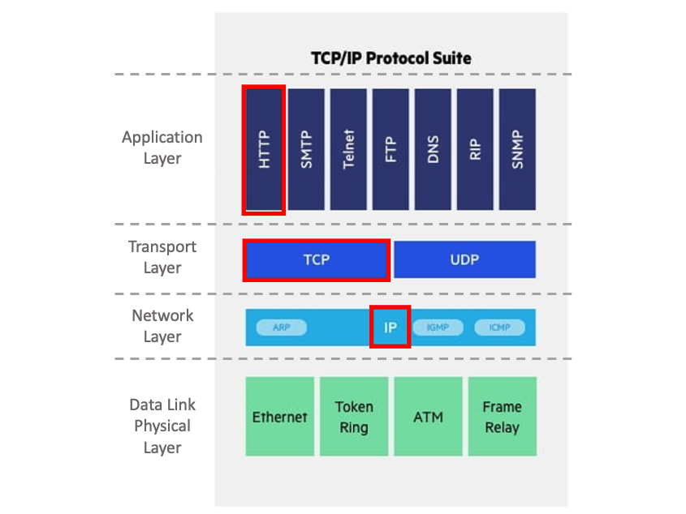

  

# 시작하며

웹 프레임워크를 열심히 공부하다가 한 순간, **프레임워크 사용법만 공부** 하고 있다는 생각이 들었습니다. 그래서 **<u>웹의 근간이 되는 HTTP</u>** 에 대한 지식도 학습하고자 합니다.

  

# HTTP의 서막

인터넷 통신을 위해 사용되는 **HTTP** 를 이해하려면, 무엇을 알아야 할까요?
 => 저는 'IP' 와 'TCP' 이야기부터 해보려고 합니다. 다음 그림을 보시면 제가 왜 그러는지 알겁니다.

 

   

*Source : https://www.imperva.com/learn/application-security/osi-model/*

 

즉, 한 뎁스만 더 들어가서 인터넷 통신을 바라본다면, 결국 패킷은 Application Layer부터 Physical Layer으로 내려가니 IP와 TCP이야기를 하지 않을 수 없습니다.

cf) 참고 : <a href="https://osj3474.github.io/network/network05/" target="_blank">[Network] 웹서버까지의 통신 </a>

  

# IP(Internet Protocol)

### 1) 역할 

1. 호스트의 주소 역할을 한다.
2. 패킷 단위로 데이터를 전달한다.

### 2) 한계

1. 상대방이 통신 가능한 상태인지 상관없이 패킷을 보낸다.
2. 중간에 패킷이 유실되었는지 알지 못한다.
3. 패킷이 순서대로 도착하지 않을 수 있다.

### 3) 버전 별 특징 (IPv4, IPv6)

|                       | IPv4                  | IPv6                  |
| --------------------- | --------------------- | --------------------- |
| 주소          | 32bit           | 64bit             |
| 헤더          | 20Byte ~ 60Byte | 40Byte            |
| fragmentation | ⭕️               | ❌                 |
| checksum      | ⭕️               | ❌                 |
| alignment     | 4Byte(32bit)    | 8Byte(64bit)      |
| 표현          | dotted decimal  | hexadecimal colon |

 

cf) IP주소는 컴퓨터를 부팅하면, DHCP가 부여해준답니다.

  

# TCP(Transmission Control Protocol)

### 1) 특징 

1. 연결하고 데이터를 보낸다. (3way handshake)
     1) 클라이언트  -\-\-\-\-\-\-(SYN)-\-\-\-\-> 서버 
    2) 클라이언트 <-\-\-(SYN, ACK)-\-\-\- 서버
    3) 클라이언트  -\-\-\-\-\-\-(ACK)-\-\-\-\-> 서버 

2. 상대방이 데이터를 받았는지 알 수 있다.
     1) 클라이언트  -\-\-\-\-\-(데이터)-\-\-\-\-> 서버 
    2) 클라이언트 <-\-\-\-(ACK)-\-\-\-\- 서버
     cf) time out되는 시간은 네트워크 상황에 따라 다르지만, 
     RTT(Round Trip Time, 클라이언트에서 서버로 패킷이 갔다가 오는 시간)보다 작으면 안된다. 

3. 순서를 보장한다.
    : 2번째 패킷이 안 왔는데 3번째 패킷 왔다면, 2번째 패킷부터 다시 보내게 한다. 

4. 1:1 통신이다.
    : 그래서 Multi Service는 UDP로 한다. 

5. Flow control이 가능하다.
    : receiver의 buffer에 따라 전송하기 때문에, buffer overflow를 막을 수 있다. 

6. Congestion control이 가능하다.
    : 네트워크 처리 속도가 느릴 수 있는데, sender가 데이터 전송 속도를 조절할 수 있다. 

 
 
cf) HTTP/3이 나오면서, UDP가 다시 주목 받고 있습니다!!
 그런 의미에서 **UDP(User Datagram Protocol)** 특징을 말한다면,

- 데이터 전달을 보증해주거나, 순서가 보장되진 않지만, 단순하고 빠릅니다.
- IP와 거의 같고, PORT정보와 체크섬만 추가되었습니다.
- DNS에 사용되는 것이 대표적인 예입니다.

 

cf) 마지막으로 하나의 IP로 여러 다른 IP와 통신이 가능한 이유는, TCP/UDP가 가지고 있는 PORT정보 때문입니다.
 
 

다음 편부터, 본격적인 HTTP를 시작해봅시다.🚀 🚀 🚀

   